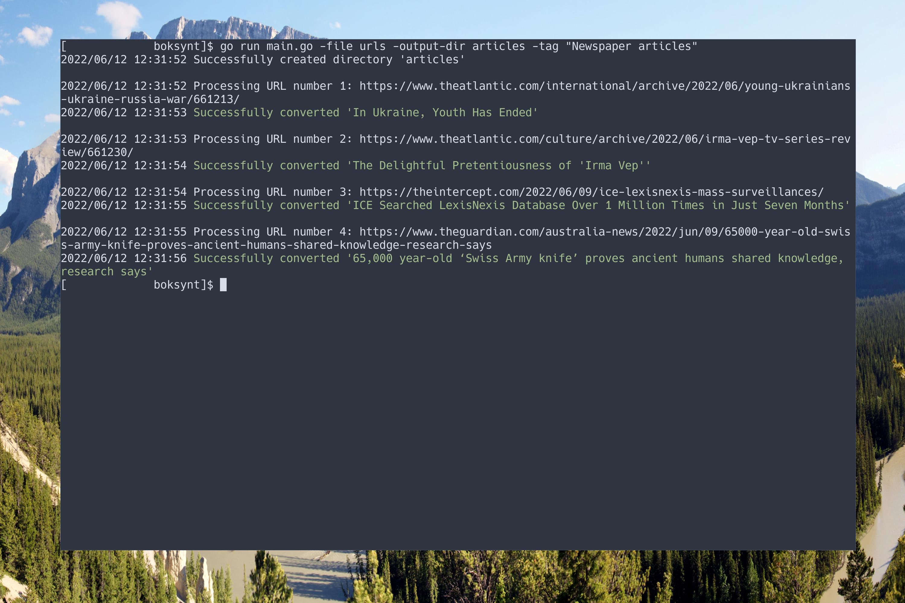

# boksynt

_boksynt_ is a simple CLI tool for downloading and converting articles
to the EPUB format so that they can be put on an e-book reader or just
read without any clutter and offline in your favorite EPUB reading
software.

## Installation

To use the latest release:

1. Dowload the latest binary release from GitHub and run it directly
   with `./boksynt` or put it in your PATH so you can run `boksynt` from
   anywhere.
2. To use the latest development version:
    1. Clone this repo.
    2. You can immediately use it with `go run main.go`.

## Requirements

You need to have [pandoc](https://github.com/jgm/pandoc/) installed for
_boksynt_ to work. Other dependencies are specified in `go.mod` and
should be handled automatically if you're running boksynt from the
cloned repo.

## Usage

The following flags are available:

```
Usage of Boksynt:
  -f, --file string
                Path to file with URLs to articles to be fetched and converted
  -o, --output-dir string
                Directory where the final epub files should be placed
  -t, --tag string
                Comma separated list of tags that should be added to articles
```

The flow is:

1. Create a file with URLs that you want downloaded and converted.
2. Run the app and provide the path to your file to the `--file` flag.

Running the following:

```
boksynt --file urls --output-dir articles --tag "Newspaper articles"
```

You should get output that looks somewhat like this:



If the file `urls` has the following content:

```text
https://www.theatlantic.com/international/archive/2022/06/young-ukrainians-ukraine-russia-war/661213/
https://www.theatlantic.com/culture/archive/2022/06/irma-vep-tv-series-review/661230/
https://theintercept.com/2022/06/09/ice-lexisnexis-mass-surveillances/
https://www.theguardian.com/australia-news/2022/jun/09/65000-year-old-swiss-army-knife-proves-ancient-humans-shared-knowledge-research-says
```

## Development status

This is a work in progress, but the basic functionality is there.
Third-party software
[Go-Readability](https://github.com/go-shiori/go-readability) which is a
Golang port of [Mozilla
Readability](https://github.com/mozilla/readability) handles the actual
parsing of websites, so that part should be pretty mature.
